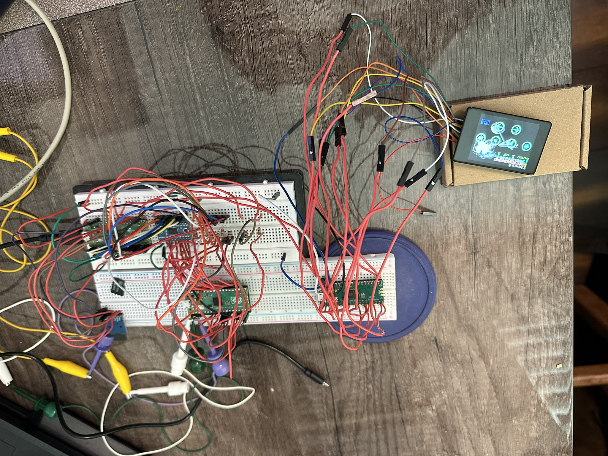
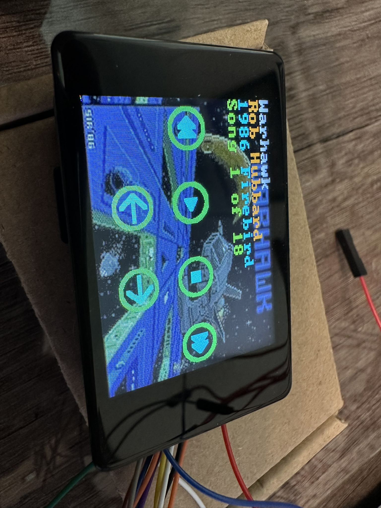
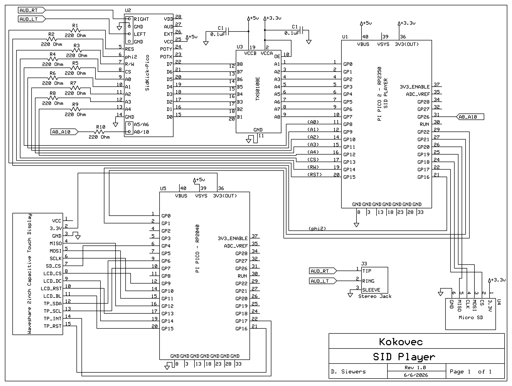

# 🎵 Raspberry Pi Pico SID Tune Player  
A multi‑Pico hardware project for playing Commodore 64 SID tunes from an SD card.

This system uses **three Raspberry Pi Pico boards** working together to deliver authentic SID playback, touchscreen controls, and visual artwork.

---

## 🧩 System Overview

This project consists of:

### **1. Player Pico 2 (RP2350)**
- Reads `.sid` files from a micro SD card  
- Handles tune playback logic  
- Sends SID register writes to the SIDKick‑Pico board  

### **2. Display Pico (RP2040)**
- Drives a **2” 240×320 IPS capacitive touchscreen**  
- Shows tune metadata, background art, and playback controls  
- Loads UI graphics from the display module’s onboard SD card  

### **3. SIDKick‑Pico (DAC version)**
- Acts as the SID chip replacement  
- Receives register writes from the Player Pico  
- Outputs authentic SID audio  

---

## ✨ Features

- Playback of **mono SID** and **2SID** files  
- Touchscreen UI with:
  - Tune metadata  
  - Background artwork  
  - Tune & subtune selection  
  - Playback controls  
- Automatic background art loading based on tune filename  
- Default artwork fallback when no tune‑specific image exists   

---

## 🖥️ Display Module Details

This project uses the **Waveshare 2” Display Module**, featuring:

- 240×320 IPS panel  
- Capacitive touch  
- 262K colors  
- Onboard SD card (used for UI graphics and background art)

### **Required Files on the Display SD Card**

| Filename        | Purpose |
|-----------------|---------|
| `controls.bmp`  | Overlay graphic for playback controls |
| `default.bmp`   | Shown when no tune‑specific art exists |
| `<tune>.bmp`    | (Optional) Background art matching `<tune>.sid` |

### **Background Art Requirements**

- **Format:** `.bmp`  
- **Resolution:** `240 × 320`  
- **Color depth:** `16‑bit` (R5 G6 B5)

All files should be placed into the root directory.  
A collection of example background images is included in this repository.  

---

## 🛠️ Hardware Design Notes

The overall hardware design is intentionally simple and robust, relying on minimal components to safely interface the three Pico boards, the SIDKick‑Pico, and the SD card.

### **SIDKick‑Pico Bus Interface**

The SIDKick‑Pico requires **3.3V ↔ 5V bidirectional level shifting** for the **8‑bit DATA bus**.  
This ensures safe communication between the 5V‑tolerant SID socket environment and the 3.3V logic of the Pico.

- The DATA bus is **bidirectional**, so proper level shifting is mandatory.
- The ADDRESS bus and control lines are **unidirectional**, so they do not require full level shifting.

### **Address & Control Lines**

The ADDRESS bus (A0–A4) and control signals (`/CS`, `/RES`, PHI2, etc.) use simple **220 Ω series resistors** for protection and signal conditioning.

This is sufficient because:
- These lines are **Pico → SIDKick‑Pico only** (unidirectional)
- The SIDKick‑Pico is designed to accept 3.3V logic on these pins

### **SD Card Storage**

A micro SD card connected to the Player Pico 2 holds all `.sid` files.

- Standard SPI wiring is used (CS, SCK, MOSI, MISO)
- The Player Pico streams SID register writes to the SIDKick‑Pico in real time

### **2SID File Requirement**

To ensure correct playback, **2SID files must include the string `2SID` in the filename**. 
This allows the Player Pico to automatically detect dual‑SID mode and configure the SIDKick‑Pico accordingly.  

# 🧩 Raspberry Pi Pico → SIDKick + SD Card + Display Pinout

This table documents the full physical pin mapping between the **Raspberry Pi Pico** and connected peripherals: **SIDKick (SID chip emulator)**, **SD card**, and **Display Pico**.

| Phys pin | Name | Used as | Connects to |
|-----------|-------|----------|-------------|
| 1 | GP0 | D0 | SID D0 (via level shifter) |
| 2 | GP1 | D1 | SID D1 |
| 3 | GND | Ground | — |
| 4 | GP2 | D2 | SID D2 |
| 5 | GP3 | D3 | SID D3 |
| 6 | GP4 | D4 | SID D4 |
| 7 | GP5 | D5 | SID D5 |
| 8 | GND | Ground | — |
| 9 | GP6 | D6 | SID D6 |
| 10 | GP7 | D7 | SID D7 |
| 11 | GP8 | A0 | SID A0 |
| 12 | GP9 | A1 | SID A1 |
| 13 | GND | Ground | — |
| 14 | GP10 | A2 | SID A2 |
| 15 | GP11 | A3 | SID A3 |
| 16 | GP12 | A4 | SID A4 |
| 17 | GP13 | /CS | SID /CS |
| 18 | GND | Ground | — |
| 19 | GP14 | R/W | SID R/W |
| 20 | GP15 | /RES | SID /RES |
| 21 | GP16 | phi2 | SID phi2 clock (PWM ~0.985 MHz) |
| 22 | GP17 | SD /CS | SD card chip select |
| 23 | GND | Ground | — |
| 24 | GP18 | SD SCK | SD card clock |
| 25 | GP19 | SD MOSI | SD card data in |
| 26 | GP20 | SD MISO | SD card data out |
| 27 | GP21 | PIO UART RX | → Display Pico RX |
| 28 | GND | Ground | — |
| 29 | GP22 | PIO UART TX | → Display Pico TX |
| 30 | RUN | Reset (unused) | — |
| 31 | GP26 | SID2 select | SIDKick $D500 – detect input |
| 32 | GP27 | free/unused | — |
| 33 | GND | Ground | — |
| 34 | GP28 | free/unused | — |
| 35 | ADC_VREF | unused | — |
| 36 | 3V3(OUT) | 3.3 V out | Level‑shifter VccA (3.3 V side) |
| 37 | 3V3_EN | unused | — |
| 38 | GND | Ground | — |
| 39 | VSYS | 5 V in (power) | board supply |
| 40 | VBUS | USB 5 V | serial/power when on USB |

---

## ⚙️ Notes

- **SID bus (D0–D7, A0–A4, /CS, R/W, /RES, phi2):** Handles communication with the SIDKick chip.  
- **SD card interface (GP17–GP20):** SPI bus for storage access.  
- **Display Pico UART (GP21–GP22):** Serial communication link.  
- **Power pins:** VSYS and VBUS provide 5 V input; 3V3(OUT) powers logic‑level components.  
- **SID2 select:** Used for dual‑SID configurations, active HIGH during 2nd‑SID writes ($D420/$D500/$DE00/$DF00).

### 🛠️ License
This documentation is released under the MIT License.  
Feel free to copy, modify, and distribute with attribution.

                    
                    ┌─────────────────┐
         SID D0 ── GP0  [ 1] [40] VBUS
         SID D1 ── GP1  [ 2] [39] VSYS
                   GND  [ 3] [38] GND
         SID D2 ── GP2  [ 4] [37] 3V3_EN
         SID D3 ── GP3  [ 5] [36] 3V3(OUT)
         SID D4 ── GP4  [ 6] [35] ADC_VREF
         SID D5 ── GP5  [ 7] [34] GP28 ── (free)
                   GND  [ 8] [33] GND
         SID D6 ── GP6  [ 9] [32] GP27 ── (free)
         SID D7 ── GP7  [10] [31] GP26 ── Sidkick A8/A10 ($D500)
         SID A0 ── GP8  [11] [30] RUN
         SID A1 ── GP9  [12] [29] GP22 ── PIO UART RX ← Display Pico TX
                   GND  [13] [28] GND
         SID A2 ── GP10 [14] [27] GP21 ── PIO UART TX → Display Pico RX
         SID A3 ── GP11 [15] [26] GP20 ── SD MISO
         SID A4 ── GP12 [16] [25] GP19 ── SD MOSI
        SID /CS ── GP13 [17] [24] GP18 ── SD SCK
                   GND  [18] [23] GND
    SidKick /OE ── GP14 [19] [22] GP17 ── SD /CS
       SID /RES ── GP15 [20] [21] GP16 ── phi2 PWM
                    └─────────────────┘

| **SID Pin** | **Name** | **Description** |
| --- | --- | --- |
| 1 | CAP1A | Filter capacitor 1A |
| 2 | CAP1B | Filter capacitor 1B |
| 3 | CAP2A | Filter capacitor 2A |
| 4 | CAP2B | Filter capacitor 2B |
| 5 | ``/RES`` | Reset (active low) ← GP15 |
| 6 | phi2 | Clock input ~1 MHz ← GP16 |
| 7 | R/W | Read/Write (low = write) ← GP14 |
| 8 | ``/CS`` | Chip select (active low) ← GP13 |
| 9 | A0 | Address bit 0 ← GP8 |
| 10 | A1 | Address bit 1 ← GP9 |
| 11 | A2 | Address bit 2 ← GP10 |
| 12 | A3 | Address bit 3 ← GP11 |
| 13 | A4 | Address bit 4 ← GP12 |
| 14 | GND | Ground |
| 15 | D0 | Data bit 0 ← GP0 |
| 16 | D1 | Data bit 1 ← GP1 |
| 17 | D2 | Data bit 2 ← GP2 |
| 18 | D3 | Data bit 3 ← GP3 |
| 19 | D4 | Data bit 4 ← GP4 |
| 20 | D5 | Data bit 5 ← GP5 |
| 21 | D6 | Data bit 6 ← GP6 |
| 22 | D7 | Data bit 7 ← GP7 |
| 23 | POTX | Potentiometer X (paddle) — unused |
| 24 | POTY | Potentiometer Y (paddle) — unused |
| 25 | VCC | +5 V supply |
| 26 | EXT_IN | External audio input — unused (tie to GND) |
| 27 | AUDIO OUT | Analog audio output |
| 28 | VDD | +12 V (6581) or +9 V (8580) |

