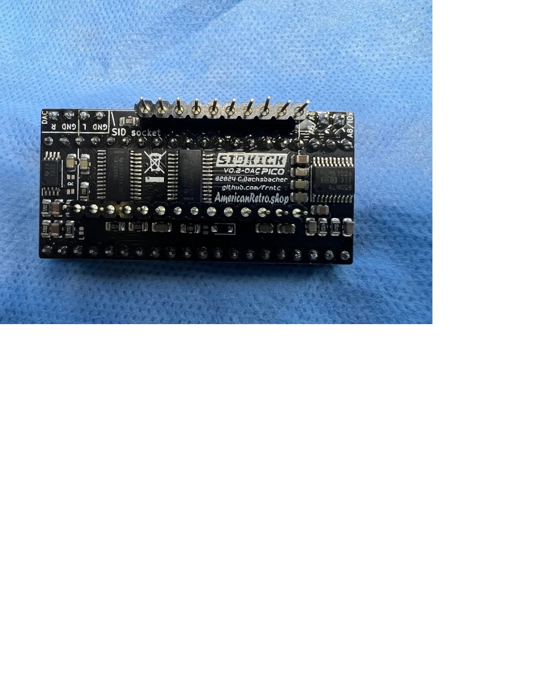

                    ┌─────────────────┐
         SID D0 ── GP0  [ 1] [40] VBUS
         SID D1 ── GP1  [ 2] [39] VSYS
                   GND  [ 3] [38] GND
         SID D2 ── GP2  [ 4] [37] 3V3_EN
         SID D3 ── GP3  [ 5] [36] 3V3(OUT)
         SID D4 ── GP4  [ 6] [35] ADC_VREF
         SID D5 ── GP5  [ 7] [34] GP28 ── (free)
                   GND  [ 8] [33] GND
         SID D6 ── GP6  [ 9] [32] GP27 ── (free)
         SID D7 ── GP7  [10] [31] GP26 ── Sidkick A8/A10 ($D500)
         SID A0 ── GP8  [11] [30] RUN
         SID A1 ── GP9  [12] [29] GP22 ── PIO UART RX ← Display Pico TX
                   GND  [13] [28] GND
         SID A2 ── GP10 [14] [27] GP21 ── PIO UART TX → Display Pico RX
         SID A3 ── GP11 [15] [26] GP20 ── SD MISO
         SID A4 ── GP12 [16] [25] GP19 ── SD MOSI
        SID /CS ── GP13 [17] [24] GP18 ── SD SCK
                   GND  [18] [23] GND
    SidKick /OE ── GP14 [19] [22] GP17 ── SD /CS
       SID /RES ── GP15 [20] [21] GP16 ── phi2 PWM
                    └─────────────────┘

| **SID Pin** | **Name** | **Description** |
| --- | --- | --- |
| 1 | CAP1A | Filter capacitor 1A |
| 2 | CAP1B | Filter capacitor 1B |
| 3 | CAP2A | Filter capacitor 2A |
| 4 | CAP2B | Filter capacitor 2B |
| 5 | ``/RES`` | Reset (active low) ← GP15 |
| 6 | phi2 | Clock input ~1 MHz ← GP16 |
| 7 | R/W | Read/Write (low = write) ← GP14 |
| 8 | ``/CS`` | Chip select (active low) ← GP13 |
| 9 | A0 | Address bit 0 ← GP8 |
| 10 | A1 | Address bit 1 ← GP9 |
| 11 | A2 | Address bit 2 ← GP10 |
| 12 | A3 | Address bit 3 ← GP11 |
| 13 | A4 | Address bit 4 ← GP12 |
| 14 | GND | Ground |
| 15 | D0 | Data bit 0 ← GP0 |
| 16 | D1 | Data bit 1 ← GP1 |
| 17 | D2 | Data bit 2 ← GP2 |
| 18 | D3 | Data bit 3 ← GP3 |
| 19 | D4 | Data bit 4 ← GP4 |
| 20 | D5 | Data bit 5 ← GP5 |
| 21 | D6 | Data bit 6 ← GP6 |
| 22 | D7 | Data bit 7 ← GP7 |
| 23 | POTX | Potentiometer X (paddle) — unused |
| 24 | POTY | Potentiometer Y (paddle) — unused |
| 25 | VCC | +5 V supply |
| 26 | EXT_IN | External audio input — unused (tie to GND) |
| 27 | AUDIO OUT | Analog audio output |
| 28 | VDD | +12 V (6581) or +9 V (8580) |

